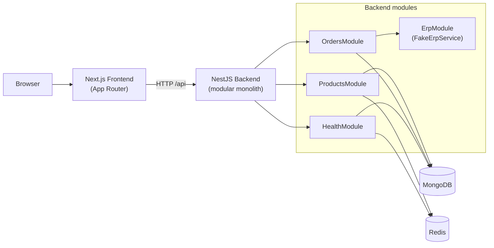
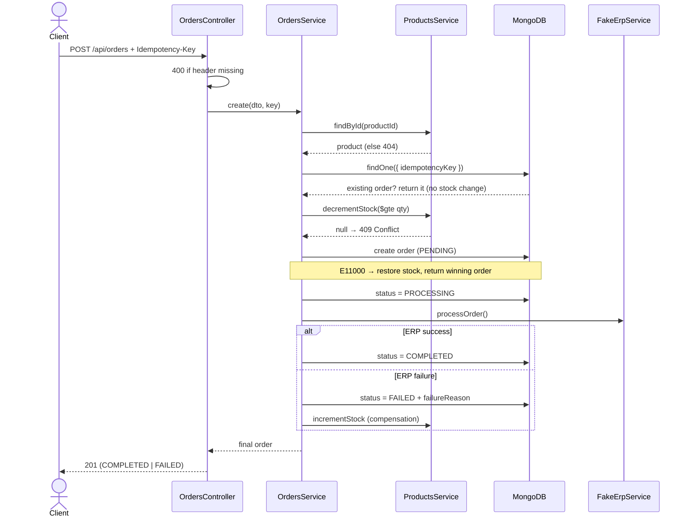
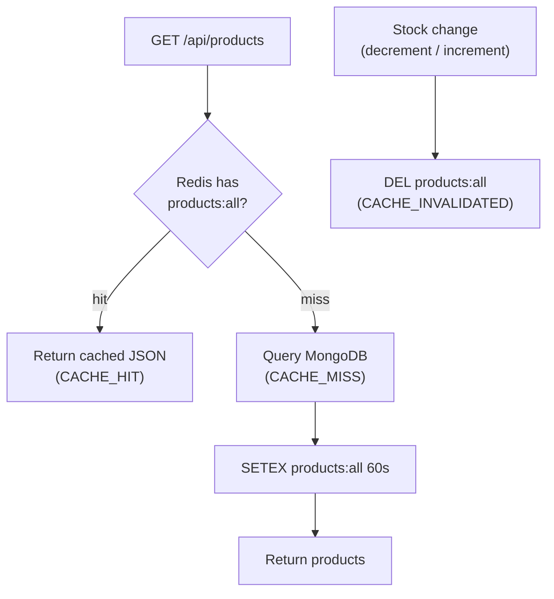

# Architecture

## Purpose

A checkout mini-flow for a phone case store: a product storefront, order creation with
atomic stock control and idempotency, and integration with a simulated ERP.

## Technologies

| Layer       | Technology                          |
|-------------|-------------------------------------|
| Backend     | NestJS 11 (TypeScript)              |
| Frontend    | Next.js 16 (TypeScript + Tailwind)  |
| Database    | MongoDB 7 (Mongoose)                |
| Cache / KV  | Redis 7 (ioredis)                   |
| Logging     | pino / nestjs-pino                  |
| API docs    | Swagger / OpenAPI (@nestjs/swagger) |
| Dev infra   | Docker Compose                      |

## System Architecture



The backend is a single NestJS process. `SharedModule` (`@Global`) wires configuration,
Mongoose, the logger, and the Redis client so every domain module inherits them. The ERP
is an in-process service that models an external dependency boundary.

## Modules

```
AppModule
├── SharedModule (@Global) — ConfigModule, MongooseModule, LoggerModule, Redis provider
├── HealthModule           — GET /api/health (terminus: MongoDB + Redis)
├── ProductsModule         — GET /api/products + automatic seed + cache-aside
├── OrdersModule           — POST /api/orders, GET /api/orders/:id (checkout core)
└── ErpModule              — FakeErpService (simulated external ERP)
```

## Strategies

### Storefront (Products)

- `GET /api/products` returns all products sorted by name.
- Automatic seed on boot (`OnModuleInit`): inserts 5 products only when the collection is
  empty — idempotent across restarts.
- Cache-aside via Redis (see [Cache Flow](#cache-flow)).

### Stock control

- Conditional atomic operation:
  `findOneAndUpdate({ _id, stock: { $gte: qty } }, { $inc: { stock: -qty } })`.
- A `null` result means insufficient stock → **HTTP 409** (no overselling).

### Idempotency

- `Idempotency-Key` header is required on `POST /api/orders` (**400** if missing).
- Unique index on `orders.idempotencyKey` is the source of truth.
- A pre-check returns the existing order on retries; a concurrent duplicate insert raises
  `E11000`, which is caught to return the winning order (and restore reserved stock).

### ERP

- `FakeErpService` simulates latency, timeout, and configurable failures via env vars.
- On failure the order is marked `FAILED` and the reserved stock is restored (compensation).
- `POST /api/orders` **always returns HTTP 201** with the final order; the `status` field
  (`COMPLETED` / `FAILED`) carries the outcome.

### Order status

`PENDING → PROCESSING → COMPLETED | FAILED`

### Health check

`GET /api/health` via `@nestjs/terminus` aggregates:
- MongoDB ping (`MongooseHealthIndicator`).
- Redis ping (custom `RedisHealthIndicator` — terminus has no built-in Redis indicator).

## Checkout Flow



## Cache Flow



- **Key:** `products:all` — **TTL:** 60 seconds.
- **Invalidation:** `DEL products:all` on `decrementStock()` (successful reservation) and
  `incrementStock()` (compensation).
- Structured log events: `CACHE_HIT`, `CACHE_MISS`, `CACHE_INVALIDATED`.

## Container Architecture

```
docker compose up --build
├── mongo     (mongo:7, port 27017, volume mongo-data)
├── redis     (redis:7-alpine, port 6379, volume redis-data)
├── backend   (node:22-alpine, port 3001, depends_on mongo+redis healthy)
│   └── dist/main — compiled NestJS app
└── frontend  (node:22-alpine, port 3000, depends_on backend)
    └── .next/standalone/server.js — Next.js standalone server
```

`NEXT_PUBLIC_API_URL` is passed as a Docker build ARG and baked into the client bundle at
image build time. Default: `http://localhost:3001/api` (the backend port mapped to the
host, reachable by the browser).

## Out of scope (intentional)

| Item                  | Reason                                                          |
|-----------------------|----------------------------------------------------------------|
| Kafka / RabbitMQ      | Synchronous flow; messaging adds no value at this scope.       |
| Kubernetes            | Docker Compose covers development and demo adequately.         |
| CQRS / Event Sourcing | Disproportionate complexity for the data model.                |
| Terraform / IaC       | Deployment is documented in the README; no IaC is delivered.   |
| Real microservices    | Modular monolith with clear boundaries; ready for extraction.  |
| Real payments         | Outside the challenge scope.                                   |
